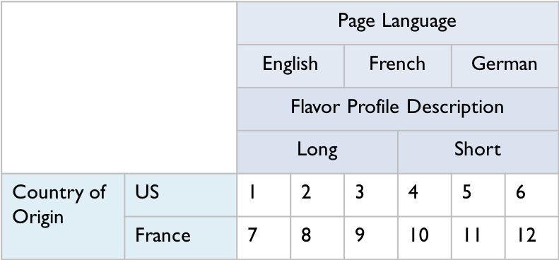
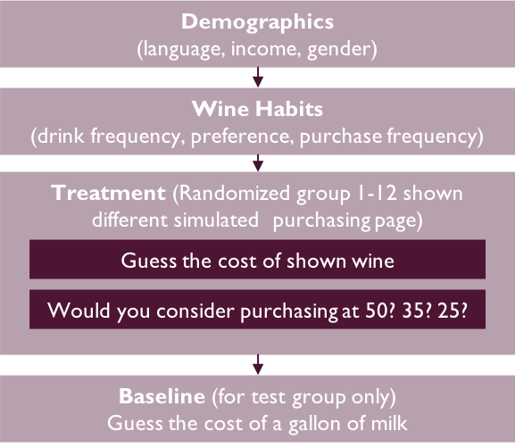
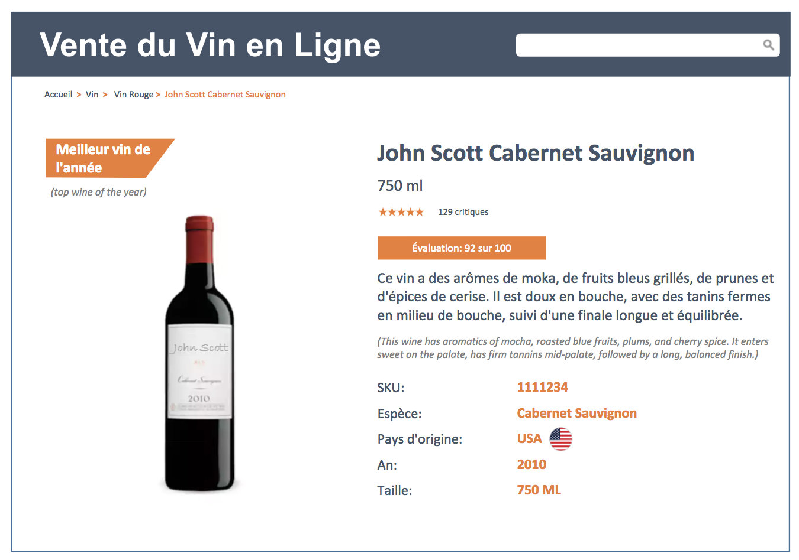
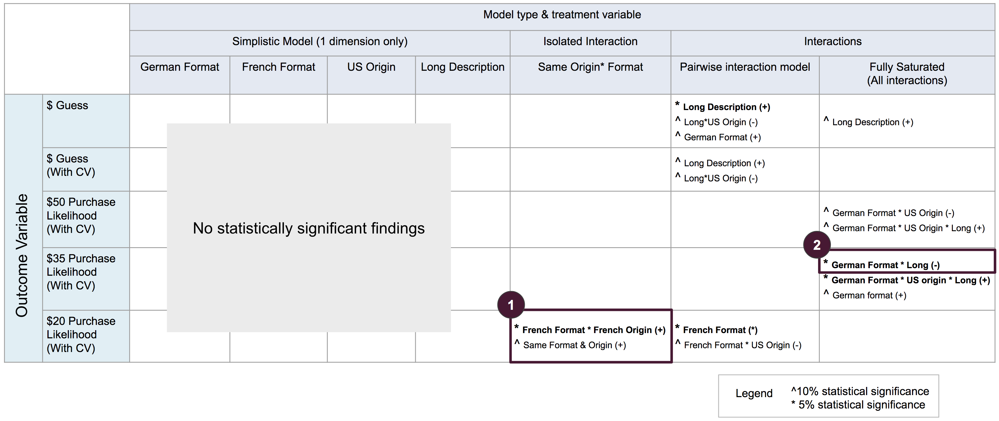

```{r setup, include=FALSE}
knitr::opts_chunk$set(echo = TRUE)
knitr::opts_knit$set(root.dir = normalizePath("./"))
knitr::opts_chunk$set(fig.width = 8, fig.height = 5)
```

## Introduction

When walking through the grocery store, one can easily spot products with foreign-language labels - “Vins de France” on a wine bottle, “Wirklich gut!” on a sausage pack, etc. Advertisers often confront consumers with foreign languages, such as German or French [^1]. In fact, the use of foreign language in advertising is a well-studied topic. According to the study done by France Leclerc, Bernd Schmitt and Laurette Dubé,showing French pronunciation of a brand name affects the perceived hedonism of the products, attitudes toward the brand, and attitudes toward the brand name[^2]. Furthermore, Jos Hornikx and Frank van meurs exclaim in their study that the use of foreign language serves as a strong cue for a product's country of origin, and the associations that the foreign language evoke and those that the country-of-origin evoke are similar[^3].

[^1]: Jos Hornikx, Frank van Meurs & Robert-Jan Hof (2013) The Effectiveness of Foreign-Language Display in Advertising for Congruent versus Incongruent Products, Journal of International Consumer Marketing, 25:3, 152-165, DOI: 10.1080/08961530.2013.780451

[^2]: Leclerc, F., B. H. Schmitt, and L. Dubé. 1994. Foreign branding and its effects on product perceptions and attitudes. Journal of Marketing Research 31 (2):263–270

[^3]: Jos Hornikx & Frank van Meurs (2017) Foreign Languages in Advertising as Implicit Country-of-Origin Cues: Mechanism, Associations, and Effectiveness, Journal of International Consumer Marketing, 29:2, 60-73, DOI: 10.1080/08961530.2016.1243996

While scholars seem to agree that foreign language advertising shapes product perception by implicitly giving consumers cues on product's country of origin, few of the existing studies dive deep into the causal link between foreign language and consumer’s purchase likelihood. This is an important causal link to establish. At the end of the day, the success of an advertising campaign is, or should be measured by the additional sales the campaign generates. Without an understanding of whether having foreign language in product communications increases sales, advertisers will be ill-guided in their decision to apply such advertising techniques.

In our study, we seek to understand the relationship between foreign language advertising and consumer willingness to pay. To narrow down our scope for a manageable experiement, given our time and resource constaints, we decided to focus on one particular product: wine. The high variance of wine prices, and the strong association between place of origin and the signal on quality makes it a great subject for our study.

## Experimental Design
To fully understand the relationship between foreign language advertising and wine purchases, we drafted a multi-factorial design for our experiement. There are three main factors that we want to investigate: advertising language, wine's country of origin, and length of flavor profile description.

For advertising language, we will test 3 languages: English (as baseline), French and German. We selected French because France is typically perceived as a premium wine production country, and we hypothesize that advertising in French will increase consumer's willingness to pay. We also selected German as a comparison language. Germany is not typically associated with wine, and therefore, by including German, we will be able to see whether the effect of having foreign language is limited to the language of the country associated with a product, or whether it expands to other languages as well.

For the wine's country of origin, we included US and France. Here we are particularly interested in the interaction between country of origin and advertsing language. Prior studies have found that foreign-language advertising serves as country of origin cues. By including country of origin as a variable, we are able to see whether foreign language has any additional impact when the country of origin is included.

For flavor profile description, we have two versions - long and short. We believe that this could be a proxy for foreign language "dosage". A long flavor profile in French might be more noticeable than a short French tagline, and may amplify the effect that we find.

To summarize, we have a 3 x 2 x 2 design, which results in 12 treatment conditions. (See summary in figure 1).




Because of time and resource constraints, we could not conduct a real-life experiement with actual wines in actual stores. Instead, we conducted the study through a Qualtrics survey and gathered responses via Mechanical Turk. The survey is structured into the sections shown in Figure 2.




We start with some demographic question about participants' primary language, income and gender. These will serve as covariates in our regression models. Then, we ask participants about their wine-related behavior, including how often they drink wine, whether they like Cabernet Sauvignon, and how often they purchase bottles of wine. We think that these wine-related behavior will explain some of the variation in willingness-to-pay, and therefore will be good covariates that help us reduce our standard error. The third section is the main part of our experiement where we introduce the treament. Here, we randomly assign the participants into one of the twelve groups mentioned above, and show them a simulated purchasing page (example seen in Figure 3).



In the simulated wine page, we translate all texts into the groups assigned language, and provide english translation for key elements (e.g. flavor profile, 'top wine of the year' tag) to ensure that the respondent understands the information. All groups are shown the same wine (which was a hypothetical wine fabricated by us), and the same descriptive information. We made the decision to present the page entirely in French or German for related tracks because we wanted to make sure participants noticed our language treatment.

We then ask the respondents to guess the cost of the wine. This is an un-anchored direct pricing question, aimed to understand respondents' first perception of the wine shown. Afterwards, we use a simplified version of the Gabor Granger method developed by André Gabor and C. W. J. Granger in the 1960s [^4]. In this method, we ask respondents whether they would consider purchasing the shown wine at $50. If respondents say no, we ask the same question at a lower price point of $35. If they still answer no, we lower the price further to $20. Through this series of 3 questions, we seek to understand where their true willingness-to-pay lies. We selected the 3 price points to cover a wide range of potential willingness-to-pay, and validated our choice through a pilot study of 100 respondents. From the pilot, we saw that most respondents' willingness to pay fell into the \$20-\$50 price range.

[^4]: Gabor, A. and Granger, C. (1966). Price as an Indicator of Quality: Report on an Enquiry. Economica, 33(129), p.43.

Our survey is concluded after the treatment section for our main sample of 1200 respondents. We used the data from this main sample to run various regressions and randomized inferences that sought to answer our research question. 

However, to validate the findings from this main sample, we collected another (smaller) sample of 600 observations. The data from this second batch of respondents served as our validation test. By running the key models we deemed important (with statistically significant findings) from main sample with this validation data set, we can confirm that the relationship we found is real.

In our second launch, we maintained the same survey experience by asking the same questions in the same sequence. However, we did introduce a baseline question at the very end of the second survey, asking respondents to estimate the price of a gallon of milk. Because this question came at the very end of the survey, it should not interfere with our treatment, and would not create any difference between the data from first and second launch. However, having this baseline question helps us establish a reference price point for respondent's price guesses, and adjust for any overall inflated / deflated guesses.

## EDA and Data Cleansing  

After loading the data gathered from our survey, we first went through some general data processing and examined descriptive statistics to better understand our general results. Table 1 and Figures 4 & 5 below helped support the team in getting a high-level summary of the data. With regards to Figure 4, the team noticed considerable variance in respondent's price perception but that the large majority of guesses fell between \$1-\$100 dollars. This finding greatly influenced our model building decisions. With regards to Figure 5, the team was pleased to see a rather normal distribution for both purchase frequency and drink frequency. Additionally, we noticed that English was the primary language for almost all of our respondents, and that a menial number of respondents were fluent in either German or French; these are encouraging statistics considering that we want to evaluate the effect of languages that are "foreign" to our users.  

```{r, include=FALSE}
d = read.csv('1st_Launch_Full.csv')
# load packages 
library(knitr)
library(data.table)
library(dplyr)
library(tidyr)
library(foreign)
library(lmtest)
library(sandwich)
library(multiwayvcov)
library(stargazer)
library(ggplot2)
library(MASS)
```

```{r, include=FALSE}
#Functions for later use
standard_conf_int_95 = function(regression, n){
  r = coeftest(regression, vcovHC(regression))
  upper_bound = r[n,1] + 1.96* r[n, 2] 
  lower_bound = r[n,1] -1.96* r[n, 2]
  return (c(lower_bound,upper_bound))
}
```

```{r, include=FALSE}
#Process/clean variables- covariates
d<-data.table(d)
#English as primary language
d$English_as_primary<-d[,.(abs(d$English_as_primary-2))]
d$English_as_primary<-as.factor(d$English_as_primary)
#Male: original, male=1, female=2
d$Male<-d[,.(abs(d$Male-2))]
d$Male<-as.factor(d$Male)
#household income- as factor due to <20k, >100k, and do not answer
d$Household_Income<-as.factor(d$Household_Income)
#Other languages- Blank is only English, French 1, German 2, Other 3
d$Speaks_German<-as.numeric(d[,Other_Language_Spoken %like% "2"])
d$Speaks_French<-as.numeric(d[,Other_Language_Spoken %like% "1"])

#Drink Frequency- options are not linear 
d$Drink_Frequency<-factor(d$Drink_Frequency)

#Cab preference
d$Cab_Preference<-d[,.(abs(d$Cab_Preference-2))]

#Purchase Frequency- also not linear
d$Purchase_Frequency<-factor(d$Purchase_Frequency)

d_factor<-d
```

```{r,include=FALSE}

#survey question datalabels. This does not work perfectly....
#to be used in demographic barplots, with name.arg()
English_as_primary<-c("No","Yes")
Male<-c("Female","Male")
Household_Income<-c("<$20,000","$20,000 to $34,999","$35,000 to $49,999",
                    "$50,000 to $74,999","$75,000 to $99,999",">$100,000","Prefer not to answer")
Speaks_German<-c("No","Yes")
Speaks_French<-c("No","Yes")
Drink_Frequency<-c(">Weekly","Weekly","Monthly","Seldom","Never")
Cab_Preference<-c("No","Yes")
Purchase_Frequency<-c(">Weekly","Weekly","Monthly","Seldom","Never")

demographics_labels<-list(English_as_primary,Male,Household_Income,Speaks_German,Speaks_French,Drink_Frequency,Cab_Preference,Purchase_Frequency)
demographics<-list(d$English_as_primary,d$Male,d$Household_Income,d$Speaks_German,d$Speaks_French,d$Drink_Frequency,d$Cab_Preference,d$Purchase_Frequency)

#demographics_labels[1]
```


```{r, echo = FALSE, results='asis', fig.cap="\\label{fig:figs}Guess the Cost, Pre-Cleaning"}
d<-data.table(d)
demographics=data.table(d[,.(English_as_primary,Male,Household_Income,Speaks_German,Speaks_French,Drink_Frequency,Cab_Preference,Purchase_Frequency)])
stargazer(d[,.(Guess_the_Cost,Purchase_50,Purchase_35,Purchase_20)],type="latex",title = "Output variables, Pre-Cleaning", header = F)
#stargazer(d[,.(English_as_primary,Male,Household_Income)], type = "text")
hist(d$Guess_the_Cost[d$Guess_the_Cost],main="Guess the Cost, Pre-Cleaning",breaks=100,xlab= "Guessed cost")

```

```{r, echo = FALSE, fig.cap="\\label{fig:figs}Univariate Analysis of Covariates- Pre-Cleaning"}
par(mfrow=c(3,3))
#look at randomization/tracks 
barplot(prop.table(table(d$Track)),main="Distribution across Tracks, Normalized",names.arg = c(-1:12))
#Important to note- 0 on barchart is N/A or attrition.
for (i in (1:length(names(demographics)))){
  #print(summary(demographics[,..i]))
  barplot(table(demographics[,..i]),
           main=names(demographics)[i]
          #,names.arg = demographics_labels[i]
          )}
```

After evaluating these high-level statistics, we proceeded to analyze more granular details regarding each submission and discovered the following areas that require attention: 

1). There was ~5% attrition (i.e. 5% of the respondents did not finish their survey). The attrition we see falls into 2 categories: pre-treatment attrition and post-treatment attrition. For pre-treatment attrition, we proceeded to clean them out completely, because these respondents were not exposed to treatment yet, and their dropping off can't have anything to do with treatment we introduce. Dropping them will not create bias in our data. For post-treatment attrition, we wanted to be more careful. We will examine these later on to understand whether we have differential attrition based on treatment assigned.

2). There was ~1/3 of respondents that have duplicated IP address and/or geographical coordinates (latitude and longitude). We are worried about these responses because they might be repeat survey takers (that potentially got exposure to more than one treatment), or they might be bots or click farms that do not answer surveys seriously. We proceed to clean out all responses that do not have a unique ip address and/or geographical coordinates.

3). As seen from Figure 4, we reiterate that we noticed many large outliers for guess-the-cost. The large variation in the answers will hurt our ability to obtain a reasonable standard error and find significant findings. We need to pay special attenion in our modeling phase later, to try to minimize the effect of outliers.
  

```{r deduping, include = FALSE}
# Cleaning out incomplete responses before treament exposures
d <- d[!is.na(d$Track),]
#summary(d)

# Counting occurances of IP address and Geo-codes
d$geo_code <- paste(d$LocationLatitude, d$LocationLongitude)
dt = data.table(d)
dt[, `freq_geo` := .N, by = geo_code]
dt[, `freq_ip` := .N, by = IPAddress]
#class(as.data.frame(dt))
#dt
## Creatig dedupped dataset where we do not allow any duplicates in IP or Geo code

complete_dedup<- dt[dt$freq_ip==1 & (dt$freq_geo == 1 | (dt$geo_code == 'NA NA' & Track!= ''))]

d<-complete_dedup
```

After cleaning the data, we analyzed the previous descriptive statistics once more to see the effects. Below, in Table 2 and Figures 6 & 7, we see that cleaning reduced our outlier problem significantly for guess-the-cost, although considerable variation still exists. 

```{r, echo = FALSE, results='asis', fig.cap="\\label{fig:figs}Guess the Cost, Post-Cleaning"}
d<-data.table(d)
demographics=data.table(d[,.(English_as_primary,Male,Household_Income,Speaks_German,Speaks_French,Drink_Frequency,Cab_Preference,Purchase_Frequency)])

stargazer(d[,.(Guess_the_Cost,Purchase_50,Purchase_35,Purchase_20)],type="latex",title = "Output variables, Post-Cleaning", header = F)
hist(d$Guess_the_Cost[d$Guess_the_Cost],main="Guess the cost, Post-Cleaning",breaks=100,xlab= "Guessed cost")
```

```{r, echo = FALSE, fig.cap="\\label{fig:figs}Univariate Analysis of Covariates- Post-Cleaning"}

par(mfrow=c(3,3))
#look at randomization/tracks 
barplot(prop.table(table(d$Track)),main="Distribution across Tracks, Normalized",names.arg = c(-1:12))
#Important to note- 0 on barchart is N/A or attrition.
for (i in (1:length(names(demographics)))){
  #print(summary(demographics[,..i]))
  barplot(table(demographics[,..i]),
           main=names(demographics)[i]
          #,names.arg = demographics_labels[i]
          )}
```


Next, the team decided to dive a bit deeper into the guess-the-cost results, to see whether a treatment effect was obvious through histograms. We evaluated histograms, in Figure 8, that were summarized at each level of our three treatment factors: 

```{r, echo = FALSE, fig.cap="\\label{fig:figs}Guess The Cost- By Treatment"}
d<-data.table(complete_dedup)
#back to factors
d$French_Purchasing_Page <- factor(d$French_Purchasing_Page)
d$German_Purchasing_Page <- factor(d$German_Purchasing_Page)
d$US_Origin <-factor(d$US_Origin)
d$Long_Description <-factor(d$Long_Description)

#hist, includes all cleaned 
#hist(d$Guess_the_Cost,main="All conditions",xlab= "Guessed cost", xlim = c(0,100),breaks=1000)
#abline(v = mean(d$Guess_the_Cost), col = "blue")
#abline(v = median(d$Guess_the_Cost), col = "green")

#formats
par(mfrow=c(1,3))
#pin(c(2,2))
#d$French_Purchasing_Page<-factor(d$French_Purchasing_Page)
hist(d$Guess_the_Cost[d$French_Purchasing_Page == 1],main = "French format",xlab= "Guessed cost", xlim = c(0,100),breaks=1000)
abline(v = mean(d$Guess_the_Cost[d$French_Purchasing_Page == 1]), col = "blue")
abline(v = median(d$Guess_the_Cost[d$French_Purchasing_Page == 1]), col = "green")

hist(d$Guess_the_Cost[d$German_Purchasing_Page == 1], main = "German format",xlab= "Guessed cost", xlim = c(0,100),breaks=1000)
abline(v = mean(d$Guess_the_Cost[d$German_Purchasing_Page == 1]), col = "blue")
abline(v = median(d$Guess_the_Cost[d$German_Purchasing_Page == 1]), col = "green")

hist(d$Guess_the_Cost[d$German_Purchasing_Page == 0 & d$French_Purchasing_Page == 0 ],main = "English format", xlab= "Guessed cost", xlim = c(0,100),breaks=1000)
abline(v = median(d$Guess_the_Cost[d$German_Purchasing_Page == 0 & d$French_Purchasing_Page == 0]), col = "green")
abline(v = mean(d$Guess_the_Cost[d$German_Purchasing_Page == 0 & d$French_Purchasing_Page == 0]), col = "blue")

```


```{r, echo = FALSE, fig.cap="\\label{fig:figs}Guess The Cost - By Origin and Description"}
#hist figures for origin, description, cleaned 
par(mfrow=c(2,2))

#Origins
d_chart=d$Guess_the_Cost[d$US_Origin == 1]
hist(d_chart,main = "US Origin Wine",xlab= "Guessed cost", xlim = c(0,100),breaks=1000)
#abline(v = mean(d_chart), col = "blue")
#abline(v = median(d_chart), col = "green")

d_chart=d$Guess_the_Cost[d$US_Origin == 0]
hist(d_chart,main = "French Origin Wine",xlab= "Guessed cost", xlim = c(0,100),breaks=1000)
#abline(v = mean(d_chart), col = "blue")
#abline(v = median(d_chart), col = "green")

#descriptions
d_chart=d$Guess_the_Cost[d$Long_Description == 0]
hist(d_chart,main = "Short Description",xlab= "Guessed cost", xlim = c(0,100),breaks=1000)
#abline(v = mean(d_chart), col = "blue")
#abline(v = median(d_chart), col = "green")

d_chart=d$Guess_the_Cost[d$Long_Description == 1]
hist(d_chart,main = "Long Description",xlab= "Guessed cost", xlim = c(0,100),breaks=1000)
#abline(v = mean(d_chart), col = "blue")
#abline(v = median(d_chart), col = "green")
```
From these historgrams of the answers, we don't observe a very apparent difference based on page language, country of origin, or length of description. This is not to say that we don't have any treatment effect, it's that the effect that our treament has may be too subtle to appear in these visualizations.

## Experimental Assumptions

Before beginning our modeling, the team proceeded to first validate our experimental assumptions, including conducting a covariate balance check, a check for potential differential attrition, and a check for potential heterogeneous treatment effects.

### Demographic/Covariate Balance Check  

For a covaraite balance check, the team regressed each treatment factor against our covariates. The goal was to use the F-statistic as an indicator of whether our covariates had any explanatory power on which treatment track a respondent was assigned to. For 3 treatment factors (Origin, Language Format, Description length) with 2, 3 and 2 levels respectively, the team ended up constructing four regressions that are listed below:


$${\scriptstyle 1)FrenchPage = \beta_0 + \beta_1Male+\beta_2Income + \beta_3EnglishPrimary+\beta_4DrinkFrequency+\beta_5CabPreference + \beta_6PurchaseFrequency+u} $$  
$$ {\scriptstyle 2)GermanPage = \beta_0 + \beta_1Male+\beta_2Income + \beta_3EnglishPrimary+\beta_4DrinkFrequency+\beta_5CabPreference + \beta_6PurchaseFrequency+u} $$  
$${\scriptstyle 3)USOrigin = \beta_0 + \beta_1Male+\beta_2Income + \beta_3EnglishPrimary+\beta_4DrinkFrequency+\beta_5CabPreference +
\beta_6PurchaseFrequency+u} $$  
$$ {\scriptstyle 4)LongDescription = \beta_0 + \beta_1Male+\beta_2Income + \beta_3EnglishPrimary+\beta_4DrinkFrequency+\beta_5CabPreference +
\beta_6PurchaseFrequency+u} $$  

In these regressions, Male, EnglighPrimary and CabPreference are binary variables. Income, Drink Frequency and Purchase Frequency represent factor vectors. Equations 1 and 2 were evaluated on subsets of our original data frame. For equation 1, the data frame only contained observations where the purchasing page was in English or French. For equation 2, the data frame only contained observations where the purchasing page was in English or German. After running all four of these regressions, the p-values for each of the F-statistics were much greater than 0.05. The team concludes that our covariate balance check passes, seeing that we cannot reject the null hypothesis that all beta values are zero for these regressions.
```{r, include = FALSE}
#d$Cab_Preference = factor(d$Cab_Preference)
#d$French_Purchasing_Page = factor(d$French_Purchasing_Page)
d$French_Purchasing_Page = as.numeric(d$French_Purchasing_Page)
d$German_Purchasing_Page = as.numeric(d$German_Purchasing_Page)
d$US_Origin = as.numeric(d$US_Origin)
d$Long_Description = as.numeric(d$Long_Description)


French_cb = lm(French_Purchasing_Page ~ Male + Household_Income + English_as_primary + Drink_Frequency + Cab_Preference + Purchase_Frequency, data = d[d$German_Purchasing_Page != 1,])

German_cb = lm(German_Purchasing_Page ~ Male + Household_Income + English_as_primary + Drink_Frequency + Cab_Preference + Purchase_Frequency, data = d[d$French_Purchasing_Page != 1,])

Origin_cb = lm(US_Origin ~ Male + Household_Income + English_as_primary + Drink_Frequency + Cab_Preference + Purchase_Frequency, data = d)

Description_cb = lm(Long_Description ~ Male + Household_Income + English_as_primary + Drink_Frequency + Cab_Preference + Purchase_Frequency, data = d)

stargazer(French_cb,German_cb,Origin_cb,Description_cb,align=TRUE,type="text", header = FALSE)

d<-data.table(complete_dedup)
```


### Attrition check

As mentioned earlier, our attrition is rather low for the entire study (~5%), so we are not very concerned about potential bias caused by possible differential attrition. However, we decided to do a check for completeness. Here, we used logistic regression (since whether or not a respondent finishes the survey is binary) to check whether being assigned to certain treatment leads to more or less attrition than others.

```{r, echo = FALSE, results='asis'} 
OR = function(regr){
  return(exp(coef(regr)))
}

attrit = subset(d, Finished == 0)
#sum(attrit$French_Purchasing_Page == 1)
#sum(attrit$German_Purchasing_Page == 1)
#sum(attrit$French_Purchasing_Page == 0 & attrit$German_Purchasing_Page == 0)

#lm_attrit_format = lm(Finished~French_Purchasing_Page + German_Purchasing_Page, d)
#lm_attrit_origin = lm(Finished~ US_Origin, d)
#lm_attrit_descrip = lm(Finished~Long_Description, d)

## Logistic regression
LR_format <- glm (Finished ~ French_Purchasing_Page + German_Purchasing_Page, data=d, family = binomial)
LR_origin <- glm (Finished ~ US_Origin , data=d, family = binomial)
LR_descrip <- glm (Finished ~ Long_Description, data=d, family = binomial)

#stargazer(lm_attrit_format,lm_attrit_origin,lm_attrit_descrip, title="Attrition Regressions-OLS", align=TRUE, type="text")

stargazer(LR_format, LR_origin, LR_descrip, coef = list(OR(LR_format), OR(LR_origin), OR(LR_descrip)), title="Attrition Regressions-Logistic with Odds Ratio", p.auto = FALSE, type = "latex", column.sep.width = "1pt", header = FALSE, font.size = "tiny")
```

After exponentiating the output coefficients, we saw from Table 3 that respondents assigned the French or German purchasing page were around 3 times less likely to finish the survey (compared to those assigned the English purchasing page). In other words, we do find evidence for differential attrition (this statistically significant finding was replicated with linear regression as well). However, since our attrition rate is very low, even if the 5% that dropped out have very extreme outcomes, they are unlikely to bias our estimate too much. Therefore, we are not very concerned about this effect. Additionally, when conducting a differential attrition check for our validation study, the team was not able to replicate the finding, and found no statistically significant effects. 

### Heterogeneous treatment effects
We tested for heterogeneous treatment effects using regression for those who answered "Never" for their wine purchasing behavior. We hypothesized that people that never purchase wine may have a rather un-firm value perception of wine, and may be influenced by our treatment more easily. In Table 4, we observe a significance in the interaction term between never-purchase and German language, which does suggest the presence of HTE.  

```{r, include = FALSE}
d<-data.table(complete_dedup)
d$Never_purchased<-rep(0,length(d$Purchase_Frequency))
d[Purchase_Frequency==5,Never_purchased := 1]
#need character format from sharad's code:

d$French_Purchasing_Page = as.numeric(as.character(d$French_Purchasing_Page))
d$German_Purchasing_Page = as.numeric(as.character(d$German_Purchasing_Page))
d$US_Origin = as.numeric(as.character(d$US_Origin))
d$Long_Description = as.numeric(as.character(d$Long_Description))

rlm.HTE_format<-rlm(Guess_the_Cost~ French_Purchasing_Page + German_Purchasing_Page+Never_purchased + French_Purchasing_Page*Never_purchased + German_Purchasing_Page * Never_purchased,d)

rlm.HTE_origin<-rlm(Guess_the_Cost~  US_Origin +Never_purchased+ Never_purchased * US_Origin,d)
rlm.HTE_description<-rlm(Guess_the_Cost~ Long_Description+Never_purchased + Never_purchased * Long_Description,d)

lm.cv_HTE<-lm(French_Purchasing_Page~Never_purchased,d)
summary(lm.cv_HTE)

```

```{r, echo = FALSE, results='asis'}
stargazer(rlm.HTE_format,rlm.HTE_origin,rlm.HTE_description, type = "latex", column.sep.width = "1pt", title =  'HTE', header = FALSE, font.size = "tiny")

```


## Modeling

### RI with limit on guesses
Our first attempt to isolate a treatment effect was by using randomization inference and the sharp null hypothesis. By nature of RI, in which a high outlier may swing the entire treatment or control group, we limited the guesses to the bottom 95%. This does not bias our results because in RI, the eliminated outliers have equal chances of falling into treatment or control. Using the reduced outcome set, we tested the simple treatments and our specified interaction (same format*origin) hypotheses, the results of which can be seen in Figures 9 and 10.

```{r, include=FALSE}
##Dedupping the factorized table to use for RI
#Convert data to omit na's (attrition)

d<- d_factor[!is.na(d_factor$Track),]
# Counting occurances of IP address and Geo-codes
d$geo_code <- paste(d$LocationLatitude, d$LocationLongitude)
dt = data.table(d)
dt[, `freq_geo` := .N, by = geo_code]
dt[, `freq_ip` := .N, by = IPAddress]
d_factor<- dt[dt$freq_ip==1 & dt$freq_geo==1]
d<- d_factor[d_factor$freq_ip==1 & d_factor$freq_geo==1]

```

```{r, echo = FALSE, fig.cap="\\label{fig:figs}RI Boxplots"}
DT<-data.table(d)
par(mfrow=c(2,1))
#for RI, only using the bottom 95percent
boxplot(DT$Guess_the_Cost,horizontal = TRUE)
title("Boxplot for Guesses, including outliers")
DT_95<-DT[Guess_the_Cost < quantile(DT$Guess_the_Cost,.95)]
boxplot(DT_95$Guess_the_Cost,horizontal = TRUE)
title("Boxplot for Guesses, bottom 95 percent of guesses")
```


```{r, include=FALSE}
#Set up RI for 0-95 of guesses
set.seed(0)

#2. calculate ate function
calculate_ate<- function(d=RI_DT,outcome,feature){
control<-outcome[feature==0]
treatment<-outcome[feature==1]
ate<-mean(treatment)-mean(control)
return(ate)
}

#3. Assume sharp null
#make new table with randomized features (input)
random_it<-function(d,outcome,feature){
d_new<-data.frame(X=sample(feature),Y=outcome)
ate<-calculate_ate(d_new,d_new$Y,d_new$X)
return(ate)
}
#random_it(RI_DT,RI_outcome,RI_feature)

#4. rinse and repeat
rep_rand_Sharpnull<-function(d,NITERS,outcome,feature){
ate_list<-rep(NA, NITERS)
  for (i in (1:NITERS)){
    ate_list[i]<- random_it(d,outcome,feature)
  }
return(ate_list)
}

RI_chartoutput<-function(DT=RI_DT, outcome=RI_outcome, RI_feature,feature_title){
  ate_obsv<-calculate_ate(DT,outcome,RI_feature)
  ate_list<-rep_rand_Sharpnull(d,NITERS=1000,outcome,RI_feature)
  p_value<-format(round(mean(ate_obsv<=ate_list), digits = 2), nsmall = 2)
  hist(ate_list,main = sprintf("Histogram under Sharp Null \n %s: P-value %s",feature_title,p_value))
  abline(v = ate_obsv, col = "blue")
  }

```

```{r, echo = FALSE, fig.cap="\\label{fig:figs}RI Sharp Null Hypothesis"}
#Formats
par(mfrow=c(2,2), ps = 10, cex = 1, cex.main = 1)
RI_chartoutput(DT_95,DT_95$Guess_the_Cost,DT_95$French_Purchasing_Page,"French Purchasing Page")
RI_chartoutput(DT_95,DT_95$Guess_the_Cost,DT_95$German_Purchasing_Page,"German Purchasing Page")
#Wine origin, Description
#par(mfrow=c(2,1))
RI_chartoutput(DT_95,DT_95$Guess_the_Cost,DT_95$US_Origin,"US Origin (vs French)")
RI_chartoutput(DT_95,DT_95$Guess_the_Cost,DT_95$Long_Description,"Long Description")

```


The results from our Randomization Inference attempt are displayed in Figure 10. Here we see no statistically significant results for all of the 4 treatments (French purchasing page, German purchasing page, US origin, and Long description. Therefore, we could not reject the sharp null hypotheses that the treatment effect is zero for all respondents. The team moved on to regression models.

##2 Model Evaluation Strategy

The first outcome of interest was respondents guesses for the price of a wine. Initially, the team wanted to see how standard OLS regressions would perform with our data. We were not very optimistic based on the considerable variance observed from our earlier descriptive statistics. Preliminary models that we built reinforced this concern. Table 5 contains simple OLS models where we used only the treatment variables as predictors. As you can see from the table, the most simplistic of regressions were returning large standard errors.  

```{r, echo=FALSE, results= 'asis'}
#basic and covariate models
lm.basic_format<-lm(Guess_the_Cost~French_Purchasing_Page+German_Purchasing_Page,d)
lm.basic_origin<-lm(Guess_the_Cost~US_Origin,d)
lm.basic_description<-lm(Guess_the_Cost~Long_Description,d)
lm.cv_format<-lm(Guess_the_Cost~French_Purchasing_Page + German_Purchasing_Page + Male + Household_Income + English_as_primary  + Drink_Frequency + Cab_Preference + Purchase_Frequency,DT)
lm.cv_origin<-lm(Guess_the_Cost~US_Origin + Male + Household_Income + English_as_primary  + Drink_Frequency + Cab_Preference + Purchase_Frequency,DT)
lm.cv_description<-lm(Guess_the_Cost~Long_Description + Male + Household_Income + English_as_primary  + Drink_Frequency + Cab_Preference + Purchase_Frequency,DT)

lm.basic_all<-lm(Guess_the_Cost ~ French_Purchasing_Page+German_Purchasing_Page+US_Origin+Long_Description,d)
lm.cv_all<-lm(Guess_the_Cost~French_Purchasing_Page+German_Purchasing_Page+US_Origin+Long_Description + Male + Household_Income + English_as_primary  + Drink_Frequency + Cab_Preference + Purchase_Frequency,DT)

stargazer(lm.basic_format,lm.basic_origin,lm.basic_description,lm.basic_all, column.sep.width = "1pt" , type="latex", font.size = "tiny", header = F, title = "Standard OLS Regressions")
#stargazer(lm.cv_format,lm.cv_origin,lm.cv_description,lm.cv_all,align=TRUE,type="text")
```
\
```{r, include = FALSE}
d$same_format_origin<-rep(0,length(d$French_Purchasing_Page))
d[French_Purchasing_Page==1 & US_Origin==0,same_format_origin :=1]
d[German_Purchasing_Page==0 & French_Purchasing_Page==0 & US_Origin==1,same_format_origin :=1]
#French layout+french wine
d$French_format_wine<-rep(0,length(d$French_Purchasing_Page))
d[French_Purchasing_Page==1 & US_Origin==0,"French_format_wine" :=1]
#English layout + US wine
d$English_format_wine<-rep(0,length(d$French_Purchasing_Page))
d[German_Purchasing_Page==0 & French_Purchasing_Page==0 & US_Origin==1,"English_format_wine" :=1]

#models
lm.same<-lm(Guess_the_Cost ~  same_format_origin + Male + Household_Income + English_as_primary + Drink_Frequency + Cab_Preference + Purchase_Frequency ,d)
#summary(lm.same)
lm.same_indiv<-lm(d$Guess_the_Cost ~ French_format_wine + English_format_wine + Male + Household_Income + English_as_primary + Drink_Frequency + Cab_Preference + Purchase_Frequency,d)
stargazer(lm.same,lm.same_indiv,type = "latex", column.sep.width = "1pt", header = FALSE, font.size = "tiny")

```


After running a few more models with covariates, the team realized that these large standard errors were going to be an issue in all OLS regression models we run. Therefore, the team decided to go with a different strategy to evaluate a treatment effect for this outcome, and that was through Robust Linear Models. The idea of this model is to weigh observations differently based on how high their residuals are. We viewed this a compromise between eliminating extreme guesses entirely from the analysis and treating all price guesses equally like we would in OLS regression. When re-running the same models with RLM, where treatment variables were the only predictors,we saw that the treatment effect dropped considerably (in Table 6); however the standard errors were more reasonable and reflective of the distribution among the majority of observations. 

```{r, include = FALSE}
#PRE-RLM data formatting
d$French_Purchasing_Page<-factor(d$French_Purchasing_Page)
d$German_Purchasing_Page<-factor(d$German_Purchasing_Page)
d$US_Origin <- factor(d$US_Origin)
d$Long_Description <- factor(d$Long_Description)

d$Male = as.character(d$Male)
d$Household_Income = as.character(d$Household_Income)
d$Cab_Preference = as.character(d$Cab_Preference)
d$English_as_primary = as.character(d$English_as_primary)
d$Drink_Frequency = as.character(d$Drink_Frequency)
d$Purchase_Frequency = as.character(d$Purchase_Frequency)
```


```{r, echo = FALSE, results= 'asis'}
rlm.format<-rlm(Guess_the_Cost~French_Purchasing_Page + German_Purchasing_Page, d)
rlm.origin<-rlm(Guess_the_Cost~US_Origin,d)
rlm.description<-rlm(Guess_the_Cost~Long_Description,d)
rlm.combined<-rlm(Guess_the_Cost~French_Purchasing_Page + German_Purchasing_Page + US_Origin + Long_Description,d)


stargazer(rlm.format,rlm.origin,rlm.description, rlm.combined, title="RLM Basic Regressions", type = "latex", column.sep.width = "1pt", header = FALSE, font.size = "tiny")
```
\
For the second outcome of interest, the team decided to evaluate three different outcomes of willingness to purchase. Since our outcomes for each of these 3 price points are binary, we decided to use binomial logistic regression as our method of analysis. With regards to the output of logistic regression models, the team chose to exponentiate the coefficients, as we could then interpret effects as the odds of purchasing the wine at a certain price point (odds ratio). The team also considered using an ordinal logistic regression instead, and looking at maximum pricepoint at which individuals would purchase; however we did not believe the levels of our willingness to purchase outcome met the conditions of the  proportional odds assumptions. Therefore we thought it would be more prudent to use binary logistic regression with three separate outcomes. 

## Model Matrix  



Figure 11 describes the different RLM and Logistic regression models we ran on our training set. Each column describes the details of predictors we used in the model, and each row describes the outcome variable for the model and whether or not covariates were included:

1) The left-hand side of the table pertains to our most simple models, where we only used the treatment variables as predictors without any interactions  
2) For Isolated Interactions we only examined the effect of treatment where the wine origin and purchasing page format are the same. For example the effect of French origin-French language treatment, or US origin-English language treatment.  
3) For pairwise interaction models, we would include only 2 of 3 treatments per model and observe their dynamic. For example, one model could include language format and description length as predictors, as well as their interaction, regardless of the origin of the wine.  
4) For the fully saturated models, we included each of the treatment variables, and all pairwise and three-prong intereactions between treatment.  

On the left-hand side of Figure 11 there is a box stating, “No Statistically Significant Findings” and that pertains to the most simplistic regressions we ran. For example, when trying to isolate the effect of wines of US Origin, regardless of the length of the flavor profile or purchasing page format, we saw no significance. As we move left to right on Figure 11 we come across some of our more detailed models. At this point, the team started to uncover some findings that are significant at the 10% level and others at the 5% level. For brevity, we will discuss the two findings we found most interesting. The first was the positive effect of the interaction between French Format and French Origin on the willingness to purchase at \$20.    

$$
\begin{aligned}
{\scriptstyle Purchase20 = \beta_0 + \beta_1FrenchFormatOrigin + \beta_2EnglishFormatOrigin + \beta_3Male+\beta_4Income + }\\ {\scriptstyle\beta_5EnglishPrimary+\beta_6DrinkFrequency+\beta_7CabPreference + \beta_8PurchaseFrequency+u}
\end{aligned}
$$  

```{r, echo = FALSE, results='asis',fig.cap="\\label{fig:figs} Log Regression - FrenchFormatOrigin" }

#models
#glm.same_50<-glm(Purchase_50~ same_format_origin + Male + Household_Income + English_as_primary + Drink_Frequency + Cab_Preference + Purchase_Frequency,family = binomial, d)
#glm.same_35<-glm(Purchase_35~ same_format_origin + Male + Household_Income + English_as_primary + Drink_Frequency + Cab_Preference + Purchase_Frequency,family = binomial, d)
#glm.same_20<-glm(Purchase_20~ same_format_origin + Male + Household_Income + English_as_primary + Drink_Frequency + Cab_Preference + Purchase_Frequency,family = binomial, d)

glm.same_indiv_50<-glm(Purchase_50~ French_format_wine + English_format_wine + Male + Household_Income + English_as_primary + Drink_Frequency + Cab_Preference + Purchase_Frequency,family = binomial, d)
glm.same_indiv_35<-glm(Purchase_35~ French_format_wine + English_format_wine + Male + Household_Income + English_as_primary + Drink_Frequency + Cab_Preference + Purchase_Frequency,family = binomial, d)
glm.same_indiv_20<-glm(Purchase_20~ French_format_wine + English_format_wine + Male + Household_Income + English_as_primary + Drink_Frequency + Cab_Preference + Purchase_Frequency,family = binomial, d)


#stargazer(glm.same_50,glm.same_35,glm.same_20, coef = list(OR(glm.same_50), OR(glm.same_35), OR(glm.same_20)), p.auto = FALSE, title="Log Regression SameFormat/Origin- Risk Ratios with  covariates", align=TRUE, type="text")

stargazer(glm.same_indiv_20, coef = list(OR(glm.same_indiv_20)), p.auto = FALSE, title="Log Regression- Same Format/Origin", type="latex", column.sep.width = "1pt", header = FALSE, font.size = "tiny")


```


The results in Table 7 indicate that a respondent was 2.075 times more likely (statistically significant at 5%) to purchase a wine of French Origin-French Format for \$20 than a respondent who saw a wine of English Origin-French Format. This made a lot of sense to us, considering that adding French language to describe a French wine could possibly attribute more authenticity to the wine.  

The second model of interest was the fully saturated model where there was a negative effect involving German Format on the willingness to purchase at $35. 

```{r, echo = FALSE, results='asis', fig.cap="\\label{fig:figs} Log Regression - Fully Saturated"}
glm.interactions_35<-glm(Purchase_35~ French_Purchasing_Page + German_Purchasing_Page + US_Origin + Long_Description + French_Purchasing_Page * US_Origin + German_Purchasing_Page * US_Origin + French_Purchasing_Page * Long_Description + German_Purchasing_Page * Long_Description + US_Origin * Long_Description + French_Purchasing_Page * US_Origin * Long_Description + German_Purchasing_Page* US_Origin * Long_Description + Male + Household_Income + English_as_primary + Drink_Frequency + Cab_Preference + Purchase_Frequency, family = binomial, d)

stargazer(glm.interactions_35, coef = list(OR(glm.interactions_35)), p.auto = FALSE, title="Log Regression Fully Saturated", type="latex", column.sep.width = "1pt", header = FALSE, font.size = "tiny")

```


$$
\begin{aligned}
{\scriptstyle Purchase35 = \beta_0 + \beta_1FrenchPurchasingPage + \beta_2GermanPurchasingPage + \beta_3USOrigin + \beta_4Long} \\ 
{\scriptstyle Description + \beta_5FrenchPurchasingPage*USOrigin + \beta_6GermanPurchasingPage*USOrigin +} \\
{\scriptstyle \beta_7FrenchPurchasingPage*Long Description + \beta_8GermanPurchasingPage*Long Description +} \\
{\scriptstyle \beta_9USOrigin*Long Description + \beta_{10}FrenchPurchasingPage*USOrigin*Long Description +} \\
{\scriptstyle \beta_{11}GermanPurchasingPage*USOrigin*Long Description + \beta_{12}Male+\beta_{13}Income + }\\ {\scriptstyle\beta_{14}EnglishPrimary+\beta_{15}DrinkFrequency+\beta_{16}CabPreference + \beta_{17}PurchaseFrequency+u}
\end{aligned}
$$  

The results in Table 8 indicate that a respondent was about 4 times less likely (statistically significant at 5%) to purchase a wine with German Language-Long Description-French Origin for \$35 than a respondent who saw a wine of English Language-Long Description-French Origin. Since German is not a language typically associated with wine, the team was curious whether German was the driving factor in respondents choice not to purchase the wine at \$35.  

##Validation Study

Based on the size of the matrix in Figure 11, it was evident that our team evaluated many regression models. Therefore, making any causal inferences from these model results would not be prudent, considering the chances of retrieving a false positive (type II error) increases considerably when running all of these models. To avoid making false causal claims and verify that our findings were legitimate, the team re-evaluated our two findings of interest on a validation set, to see if we could replicate the direction of the effect with statistical significance. 

As mentioned in the introduction, the team added a baseline price-perception question for a gallon of milk post-treatment in the validation study. By adding this baseline question, the team was able to gauge whether or not a respondent was providing guesses for cost in terms of US currency; we chose to remove all observations where respondents guessed over $10 for a gallon of milk, with the hope of ridding ourselves of harmful outliers for our outcome variables. While this method helped remove many inflated guesses, there were still a number of outliers remaining in our dataset. Therefore, the team continued with RLM instead of OLS regressesion for our Guess the Price outcome variable. 

After data collection and data cleansing for our validation set, the team went through the following tasks prior to model analysis:  

1) Conducted a covariate balance check and confirmed there were no baseline differences between the groups (in terms of our measured covariates)  
2) Observed that the differential attrition identified in our training set did not exist in our validation set. In fact, respondents who were assigned the French/German purchasing page treatments were less likely to attrit in our validation study compared to those assigned the English purchasing page (though not statistically significant). The direction of this differential attrition effect is opposite to what was observed in our training study.  
3) The heterogeneous treatment effect for never-purchasers did not persist in the validation study as well

```{r, include = FALSE}

#DATA PREP/CLEANSING
d = read.csv('Second_Launch_Complete.csv')
d = d[1287:NROW(d),] #Only data from the second launch

d <- d[!is.na(d$Track),]
#summary(d)
# Counting occurances of IP address and Geo-codes
d$geo_code <- paste(d$LocationLatitude, d$LocationLongitude)
d = d[d$Milk_Cost <= 10.00 | (d$geo_code == 'NA NA' & d$Track!= ''),]
dt = data.table(d)
dt[, `freq_geo` := .N, by = geo_code]
dt[, `freq_ip` := .N, by = IPAddress]
#class(as.data.frame(dt))
#dt
## Creatig 2 dedupped dataset, one with complete dedup where we do not allow any duplicates in IP or Geo code, and one where we exclude IP dupes, but allow up to 5 dups per geo code
complete_dedup<- dt[dt$freq_ip==1 & (dt$freq_geo == 1 | (dt$geo_code == 'NA NA' & Track!= ''))]
#nrow(complete_dedup)
five_or_less_dedup <- dt[dt$freq_ip==1 & dt$freq_geo<=5]
#nrow(five_or_less_dedup)
d<-complete_dedup


d$English_as_primary<-d[,.(abs(d$English_as_primary-2))]
d$English_as_primary<-as.factor(d$English_as_primary)
#Male: original, male=1, female=2
d$Male<-d[,.(abs(d$Male-2))]
d$Male<-as.factor(d$Male)
#household income- as factor due to <20k, >100k, and do not answer
d$Household_Income<-as.factor(d$Household_Income)

#Drink Frequency- options are not linear 
d$Drink_Frequency<-factor(d$Drink_Frequency)

#Cab preference
d$Cab_Preference<-d[,.(abs(d$Cab_Preference-2))]

#Purchase Frequency- also not linear
d$Purchase_Frequency<-factor(d$Purchase_Frequency)


d$same_format_origin<-rep(0,length(d$French_Purchasing_Page))
d[French_Purchasing_Page==1 & US_Origin==0,same_format_origin :=1]
d[German_Purchasing_Page==0 & French_Purchasing_Page==0 & US_Origin==1,same_format_origin :=1]
#French layout+french wine
d$French_format_wine<-rep(0,length(d$French_Purchasing_Page))
d[French_Purchasing_Page==1 & US_Origin==0,"French_format_wine" :=1]
#English layout + US wine
d$English_format_wine<-rep(0,length(d$French_Purchasing_Page))
d[German_Purchasing_Page==0 & French_Purchasing_Page==0 & US_Origin==1,"English_format_wine" :=1]

d$French_Purchasing_Page<-factor(d$French_Purchasing_Page)
d$German_Purchasing_Page<-factor(d$German_Purchasing_Page)
d$US_Origin <- factor(d$US_Origin)
d$Long_Description <- factor(d$Long_Description)

d$Male = as.character(d$Male)
d$Household_Income = as.character(d$Household_Income)
d$Cab_Preference = as.character(d$Cab_Preference)
d$English_as_primary = as.character(d$English_as_primary)
d$Drink_Frequency = as.character(d$Drink_Frequency)
d$Purchase_Frequency = as.character(d$Purchase_Frequency)
```

After re-running the two models of interest from the training study, we observed the following results on our validation set:  

1) Respondents were 2.252 times more likely (statistically significant at 10%) to purchase a wine of French Origin-French Format for \$20 than respondents who saw a wine of English Origin-French Format. While the direction and relative magnitude of the effect persisted from the main study, the statistical significance dropped from 5% to 10% in the validation study.   
2) Respondents were 1.592 times more likely (not statistically significant) to purchase a wine with German Language-Long Description-French Origin for \$35 than respondents who saw a wine of English Language-Long Description-French Origin. Compared to what we observed in the training study, the direction of the effect flipped and the magnitude of the effect dropped considerably. Additionally, the finding was no longer statistically significant. 


```{r, include=FALSE}
Factors_omit=c("Household_Income","Household_Income2","Household_Income3","Household_Income4","Household_Income5","Household_Income6","Household_Income7","Drink_Frequency","Drink_Frequency2","Drink_Frequency3","Drink_Frequency4","Drink_Frequency5","Purchase_Frequency","Purchase_Frequency2","Purchase_Frequency3","Purchase_Frequency4","Purchase_Frequency5")


rlm.cv<-rlm(Guess_the_Cost~French_Purchasing_Page + German_Purchasing_Page + US_Origin + Long_Description +  Male + Household_Income + English_as_primary  + Drink_Frequency + Cab_Preference + Purchase_Frequency, d)

rlm.cv1<-rlm(Guess_the_Cost~French_Purchasing_Page + German_Purchasing_Page + Male + Household_Income + English_as_primary  + Drink_Frequency + Cab_Preference + Purchase_Frequency, d)

rlm.cv2 <- rlm(Guess_the_Cost~ US_Origin + Male + Household_Income + English_as_primary  + Drink_Frequency + Cab_Preference + Purchase_Frequency,d)

rlm.cv3 <- rlm(Guess_the_Cost~ Long_Description + Male + Household_Income + English_as_primary  + Drink_Frequency + Cab_Preference + Purchase_Frequency,d)

stargazer(rlm.cv, rlm.cv1, rlm.cv2, rlm.cv3, align=TRUE, title = "RLM Basic regressions- with covariates (factors omitted from table)",omit=Factors_omit, type = "latex", column.sep.width = "1pt", header = FALSE, font.size = "tiny")
```

```{r, include = FALSE}
#Interactions - Same Format/Origin without covariates
#**No statistical significance for treatment**
#models
rlm.same<-rlm(Guess_the_Cost ~ same_format_origin, d)
#summary(lm.same)

rlm.same_indiv<-rlm(Guess_the_Cost ~ French_format_wine + English_format_wine, d)

stargazer(rlm.same,rlm.same_indiv, type = "latex", column.sep.width = "1pt", header = FALSE, font.size = "tiny")
```


```{r, include = FALSE}
d$Track<-factor(d$Track)

rlm.saturated_cv<-rlm(Guess_the_Cost~ Track + Male + Household_Income + English_as_primary + Drink_Frequency + Cab_Preference + Purchase_Frequency,d)

```


```{r, include = FALSE}

rlm.saturated<-rlm(Guess_the_Cost~ Track,d)

stargazer(rlm.saturated_cv,rlm.saturated, align=TRUE,type="text", title = "RLM regressions- Track",omit=Factors_omit)
```


```{r, include = FALSE}
rlm.interactions<-rlm(Guess_the_Cost~ French_Purchasing_Page + German_Purchasing_Page + US_Origin + Long_Description + French_Purchasing_Page * US_Origin + German_Purchasing_Page * US_Origin + French_Purchasing_Page * Long_Description + German_Purchasing_Page * Long_Description + US_Origin * Long_Description + French_Purchasing_Page * US_Origin * Long_Description + German_Purchasing_Page* US_Origin * Long_Description,d)

stargazer(rlm.interactions, align=TRUE,type="text", title = "RLM regression- with interactions")
```

```{r, include = FALSE}
rlm.i1<-rlm(Guess_the_Cost~ French_Purchasing_Page + German_Purchasing_Page + US_Origin + French_Purchasing_Page * US_Origin + German_Purchasing_Page * US_Origin,d)

rlm.i2<-rlm(Guess_the_Cost~ French_Purchasing_Page + German_Purchasing_Page + Long_Description + French_Purchasing_Page * Long_Description + German_Purchasing_Page * Long_Description,d)

rlm.i3<- rlm(Guess_the_Cost~ US_Origin + Long_Description + US_Origin * Long_Description, d)

stargazer(rlm.i1, rlm.i2, rlm.i3, align=TRUE,type="text", title = "RLM regression- with interactions")
```


```{r, include = FALSE}
d$max_purchase[!is.na(d$Purchase_50)] = "$0"
d[Purchase_50==1,max_purchase:="$50"]
d[Purchase_35==1 & Purchase_50 == 0,max_purchase:="$35"]
d[Purchase_20==1 & Purchase_50 == 0 & Purchase_35 == 0,max_purchase:="$20"]
d$max_purchase = as.factor(d$max_purchase)
d$max = relevel(d$max_purchase, ref = "$0") 


p_val = function(regr){
z <- summary(regr)$coefficients/summary(regr)$standard.errors
return((1 - pnorm(abs(z), 0, 1)) * 2)
}

risk_ratio = function(regr){
z <- summary(regr)$coefficients/summary(regr)$standard.errors
exp(coef(regr))
}

```


```{r, include = FALSE}
#Odds Ratio
OR = function(regr){
  return(exp(coef(regr)))
}
```


```{r, include = FALSE}
glm.format_50<-glm(Purchase_50~French_Purchasing_Page + German_Purchasing_Page,family = binomial, d)
glm.format_35<-glm(Purchase_35~French_Purchasing_Page + German_Purchasing_Page,family = binomial, d)
glm.format_20<-glm(Purchase_20~French_Purchasing_Page + German_Purchasing_Page, family = binomial,d)


#rlm.origin<-rlm(Guess_the_Cost~US_Origin,d)
#rlm.description<-rlm(Guess_the_Cost~Long_Description,d)
#rlm.combined<-rlm(Guess_the_Cost~French_Purchasing_Page + German_Purchasing_Page + US_Origin + Long_Description,d)

stargazer(glm.format_50,glm.format_35,glm.format_20, coef = list(OR(glm.format_50), OR(glm.format_35), OR(glm.format_20)), p.auto = FALSE, title="Log Regression Page Format- Risk Ratios with no covariates", align=TRUE, type="text")
```

```{r, include = FALSE}
glm.origin_50<-glm(Purchase_50~ US_Origin,family = binomial, d)
glm.origin_35<-glm(Purchase_35~ US_Origin,family = binomial, d)
glm.origin_20<-glm(Purchase_20~ US_Origin, family = binomial,d)


#rlm.origin<-rlm(Guess_the_Cost~US_Origin,d)
#rlm.description<-rlm(Guess_the_Cost~Long_Description,d)
#rlm.combined<-rlm(Guess_the_Cost~French_Purchasing_Page + German_Purchasing_Page + US_Origin + Long_Description,d)

stargazer(glm.origin_50,glm.origin_35,glm.origin_20, coef = list(OR(glm.origin_50), OR(glm.origin_35), OR(glm.origin_20)), p.auto = FALSE, title="Log Regression Wine Origin- Risk Ratios with no covariates", align=TRUE, type="text")
```

```{r, include = FALSE}
glm.desc_50<-glm(Purchase_50~ Long_Description, family = binomial, d)
glm.desc_35<-glm(Purchase_35~ Long_Description, family = binomial, d)
glm.desc_20<-glm(Purchase_20~ Long_Description, family = binomial,d)


#rlm.origin<-rlm(Guess_the_Cost~US_Origin,d)
#rlm.description<-rlm(Guess_the_Cost~Long_Description,d)
#rlm.combined<-rlm(Guess_the_Cost~French_Purchasing_Page + German_Purchasing_Page + US_Origin + Long_Description,d)

stargazer(glm.desc_50,glm.desc_35,glm.desc_20, coef = list(OR(glm.desc_50), OR(glm.desc_35), OR(glm.desc_20)), p.auto = FALSE, title="Log Regression Wine Description- Risk Ratios with no covariates", align=TRUE, type="text")
```

# Conclusion
The one significant finding that we have that persisted in both training and validation study (although only at 10% in the validation study) is the positive impact of French wine and French purchasing page. We found that this combination drives up purchase likelihood at $20. Advertsing in French for an entry-level French wine may be a good idea for businesses, though we recommend further validation.

Having gone through the study, we learned a lot about experimental design, and if we were to do the study again, we would improve our design in the following ways:

1. Introducing a baseline question in the training study. The milk-cost baseline question helped us control for some outlier observations, especially those caused by currency perception. Having this question in the training study would definitely help in our modeling process.

2. Limiting the geographical location of respondents. In mechanical Turk, we did not limit to only US respondents, for fear that we may not achieve our ambitious sample on time. If time permits, this limitation would be useful because it will then eliminate currency bias.

3. Increasing sample size, especially in the validation study. The large variation we see in responses also calls for large sample sizes. If we have enough time and resources, gathering a larger sample helps increase statistical power.

4. Changing treatment dosage. For this treatment, we used the "maximum dosage possible" by translating everything into the treatment language. This may have overwhelmed or confused respondents, which lead to some differential attrition in our training study. In a future study, it may be wise to reduce the treatment dosage in a more manageable way (e.g. only translating flavor profile and taglines),

5. Redesigning the guess-the-cost question. We liked the question because it is completely unanchored, which allowed us to find psychological price thresholds (like $20). However, this type of question is outlier prone. In a new study, we may consider changing this question type, or at least putting a maximum answer threshold on guess-the-cost questions implicitly, without anchoring respondents. Having an implicit max price (the highest price imaginable for a wine, say \$300), where only people that entered more than that max value would see a validation, may help us reduce the magnitude of outliers.
